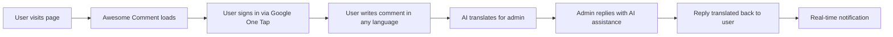

# What is Awesome Comment?

Awesome Comment is a **modern, AI-powered comment system** designed to break down language barriers and boost user engagement on your website.

## The Problem

Traditional comment systems face several challenges:
- 🌍 **Language barriers** prevent global conversations
- 😴 **Low engagement** due to poor user experience
- 🔐 **Friction in authentication** discourages participation
- 🤖 **Lack of AI assistance** makes moderation time-consuming
- 💰 **Expensive** or feature-limited solutions

## The Solution

Awesome Comment solves these problems with:

### 🤖 AI-Powered Communication
- **Auto-translation**: Comments automatically translate to your language
- **Intelligent replies**: Generate contextual responses with GPT or Gemini
- **Smart moderation**: AI helps detect spam and inappropriate content

### 👆 Seamless Authentication
- **Google One Tap**: Users sign in with one click, no password needed
- **Zero friction**: No redirect, no pop-up, no interruption
- **Privacy-focused**: Works with Auth0 or self-hosted auth

### 🌍 Global Reach
- Support for **100+ languages**
- Real-time translation powered by AI
- Localized UI for better user experience

### 📊 Powerful Admin Tools
- Batch operations for efficiency
- Advanced filtering and search
- Real-time analytics and statistics
- AI-assisted comment management

## Key Features

- ✅ **Free and Open Source** - MIT licensed
- ✅ **Self-hostable** - Own your data completely
- ✅ **Cloud Native** - Deploy on Cloudflare, Vercel, or anywhere
- ✅ **Modern Stack** - Vue 3, Nuxt 4, TypeScript
- ✅ **Performance Focused** - Fast load times, cached responses
- ✅ **Privacy First** - GDPR compliant, data control

## How It Works



## Architecture

Awesome Comment consists of three main components:

1. **Frontend Widget** - Vue 3 SPA that embeds in your page
2. **Backend API** - Nuxt 4 server with REST endpoints
3. **Admin Panel** - Web-based dashboard for comment management

```
┌─────────────────┐
│  Your Website   │
│                 │
│  ┌───────────┐  │
│  │  Comment  │  │
│  │  Widget   │  │
│  └─────┬─────┘  │
└────────┼────────┘
         │ API
    ┌────▼─────┐
    │  Backend │
    │  Server  │
    └────┬─────┘
         │
    ┌────▼─────┐      ┌──────────┐
    │ Database │      │  Redis   │
    │  (TiDB)  │      │ (Upstash)│
    └──────────┘      └──────────┘
```

## Use Cases

### Personal Blogs
Add engaging comments to your static site blog (Hugo, Jekyll, Gatsby, etc.)

### Documentation Sites
Enable community feedback on documentation pages (VitePress, Docusaurus, etc.)

### News Websites
Facilitate discussions on articles with AI moderation

### E-commerce
Let customers discuss products with multi-language support

### Community Forums
Build engaged communities with AI-assisted moderation

## Why Choose Awesome Comment?

### vs Disqus
- ✅ Free and open source
- ✅ No ads
- ✅ Own your data
- ✅ AI-powered translation
- ✅ Modern UI

### vs WordPress Comments
- ✅ Works on static sites
- ✅ No WordPress required
- ✅ Better spam protection
- ✅ AI features
- ✅ Multi-language support

### vs Facebook Comments
- ✅ No tracking
- ✅ Privacy-focused
- ✅ Customizable
- ✅ Self-hostable
- ✅ No social media requirement

## Real Results

> "After implementing Awesome Comment with AI translation, our international user engagement increased by 300%!"
> 
> — Tech Blog Owner

> "Google One Tap authentication removed all friction. Comment conversion rate went from 2% to 15%."
> 
> — E-commerce Site

> "AI-assisted moderation saved me 10 hours per week. The translation feature is game-changing."
> 
> — Community Manager

## Getting Started

Ready to add Awesome Comment to your site?

- 🚀 [Quick Start](/guide/getting-started) - 5-minute integration
- 📦 [Frontend Setup](/setup/frontend) - Detailed integration guide
- 🏗️ [Self-Hosting](/setup/self-hosting) - Deploy your own instance

## Community

- **GitHub**: [awesome-comment/awesome-comment](https://github.com/awesome-comment/awesome-comment)
- **Discord**: Join our community server
- **Twitter**: [@AwesomeComment](https://twitter.com/AwesomeComment)

## License

Awesome Comment is released under the [MIT License](https://opensource.org/licenses/MIT).
